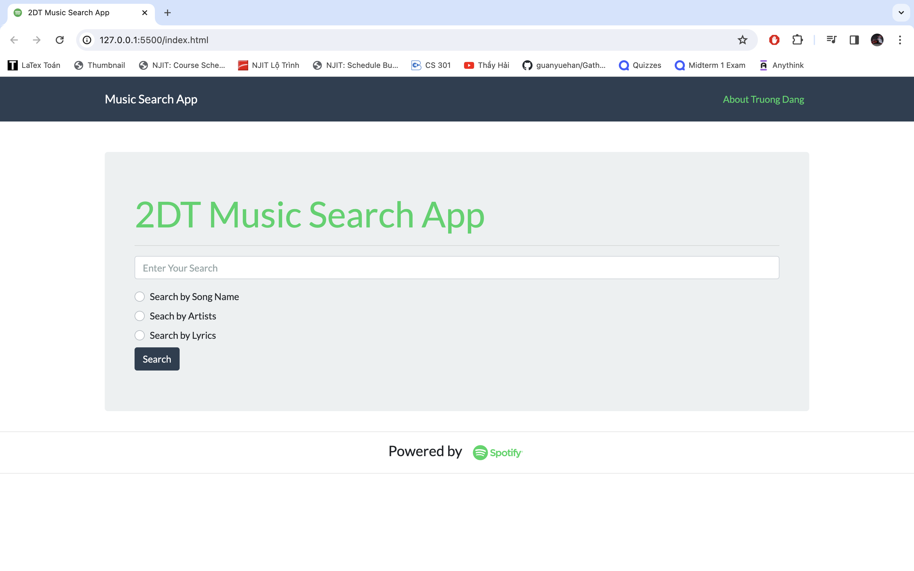
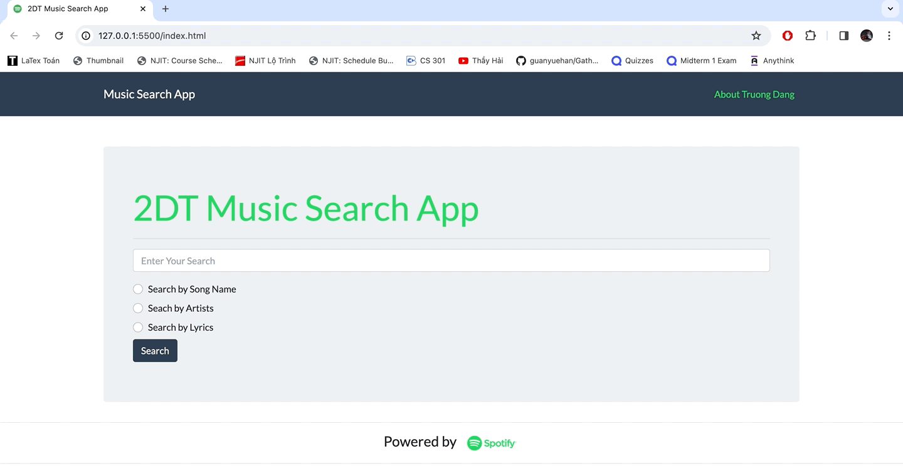

# Music Search Engine 

*Using Spotify Web API*

This **Music Search Engine** is a web-based application that leverages the Spotify Web API to provide users with the ability to search for music tracks, albums, and artists. It offers a user-friendly interface to interact with the extensive Spotify music catalog, allowing users to discover, explore, and listen to their favorite music.

## Features

- **Search by Song Name**: output the top related tracks

- **Search by Artist**: output the top related artists

- **Search by Lyrics**: update soon

- **Search by Music Catalog**: update soon

- **Access Track Information**: get detailed information about specific tracks, including artists, albums, and external links to Spotify

- **Authorization**: get token access

## Technologies

- HTML, CSS, JavaScript

- jQuery: AJAX requests and DOM manipulation

- Spotify Web API: fetch and display music-related information

## Result

## Installation

- Clone/Download project
- Open IDE (Visual Studio Code)
- Right click on `index.html` and choose **Open with Live Server**
